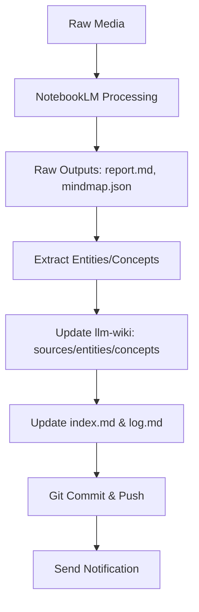

# NotebookLM to llm-wiki Integration Pattern

This document describes a pattern for integrating NotebookLM-generated outputs (reports, mindmaps, etc.) into an llm-wiki-style knowledge base.

## Overview

When processing media (YouTube videos, podcasts, etc.) through NotebookLM:
1. NotebookLM generates structured insights (reports, mindmaps, Q&A)
2. These outputs are saved as raw markdown/JSON files
3. A processing script extracts entities, concepts, and relationships
4. The llm-wiki is updated with new source, entity, and concept pages
5. Index, log, and relationship overviews are updated
6. Changes are committed and notified

## Typical Workflow



## Detailed Steps

### 1. NotebookLM Output Handling
- Save reports as `raw/notebooklm-analysis/<id>_report.md`
- Save mindmaps as `raw/notebooklm-mindmaps/<id>_mindmap.json`
- Optionally save Q&A, flashcards, etc. in appropriate raw subdirectories

### 2. Content Extraction
From reports and mindmaps, extract:
- **Entities**: Companies, products, people, technologies mentioned
- **Concepts**: Features, capabilities, methodologies, trends
- **Relationships**: Entity-Concept, Entity-Entity, Concept-Concept

### 3. Wiki Updates
#### Source Pages
Create/update `wiki/sources/<slug>.md` with:
- YAML frontmatter (title, created, updated, type: summary, tags, sources, confidence)
- Structured summary of the media content
- Links to related entity/concept pages

#### Entity Pages
For each extracted entity:
- Create/update `wiki/entities/<slug>.md`
- Frontmatter: type: entity, tags, sources, confidence
- Content: entity description, role in the media, relationships
- Minimum 2 outgoing wikilinks

#### Concept Pages
For each extracted concept:
- Create/update `wiki/concepts/<slug>.md`
- Frontmatter: type: concept, tags, sources, confidence
- Content: concept explanation, examples, related entities
- Minimum 2 outgoing wikilinks

### 4. Index & Log Updates
- Update `wiki/index.md` with new entries in correct sections (alphabetical)
- Update total page count and last updated date
- Append to `wiki/log.md` with ingest action and list of created/updated files

### 5. Version Control
```bash
git add -A
git commit -m "chore: add notebooklm analysis from {{count}} videos"
git push origin main
```

### 6. Notification
Send Telegram/Discord/etc. with:
- Action completed
- Commit hash
- Counts: new entities, concepts, sources
- Link to run log

## Error Handling
- If extraction fails: log error, continue with available data
- If wiki page already exists: append new information, update `updated` date
- Handle contradictions per llm-wiki update policy
- Verify git operations: after commit, run `git show --name-only` to confirm expected files

## Automation Considerations
- Use explicit notebook IDs in parallel workflows (`-n` flag)
- Consider per-agent isolation via `NOTEBOOKLM_PROFILE` or `NOTEBOOKLM_HOME`
- For background processing: spawn subagents to wait for NotebookLM completion then trigger wiki update