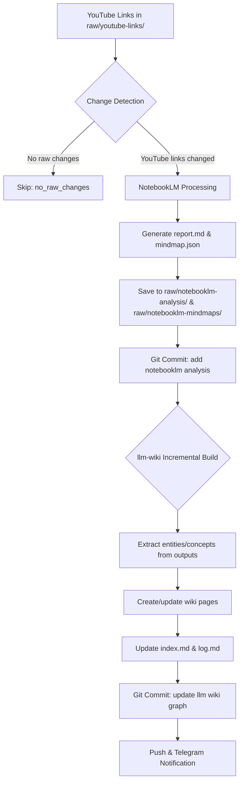

# YouTube Wiki Processing Pattern

This document describes the specific pattern used for processing YouTube video links into a structured wiki using NotebookLM for analysis and llm-wiki for knowledge graph construction, as implemented in the youtube-video-research-wiki repository.

## Overview

The workflow processes YouTube video links through NotebookLM to extract structured insights, then integrates those insights into an llm-wiki knowledge base. This creates a compounding knowledge graph where video content becomes interconnected, searchable wiki content.

## Flow Diagram



## Detailed Steps

### Step 1: Change Detection (TheSchema.md)
1. Execute protective stash/sync sequence:
   ```bash
   git stash push -u -m "webhook-auto-stash-<run_id>"
   git fetch origin && git checkout main && git pull --ff-only origin main
   git stash pop
   ```
2. Detect changes: `git diff --name-only <before> <sha> -- 'raw/*.md' 'raw/**/*.md'`
3. Filter to: `raw/youtube-links/` for YouTube processing OR `raw/notebooklm-*` for wiki updates

### Step 2: NotebookLM Processing (情景 B)
When YouTube links are detected in `raw/youtube-links/`:
1. Scan for new/changed files in `raw/youtube-links/`
2. Extract YouTube URLs using regex: `https://youtu(\.)?be(\.com)?/`
3. For each URL, call NotebookLM processing script:
   ```bash
   /home/zhouhuijuan1987/.hermes/scripts/notebooklm_processor.py <url1> <url2> ...
   ```
4. Script generates:
   - Report: `raw/notebooklm-analysis/<video-id>_report.md`
   - Mindmap: `raw/notebooklm-mindmaps/<video-id>_mindmap.json`
5. Git commit: `chore: add notebooklm analysis from {{url_count}} videos`
6. Git push

### Step 3: llm-wiki Incremental Build (情景 C)
When notebooklm analysis/mindmaps are detected:
1. Execute protective stash/sync sequence (same as above)
2. Detect changes in `raw/notebooklm-analysis/` and `raw/notebooklm-mindmaps/`
3. Process each new/changed analysis file:
   - Extract title, entities, concepts from report and mindmap
   - Create source summary page in `wiki/sources/`
   - Create entity pages in `wiki/entities/` (minimum 2 outbound wikilinks)
   - Create concept pages in `wiki/concepts/` (minimum 2 outbound wikilinks)
4. Update `wiki/index.md`:
   - Add new entries alphabetically within sections
   - Update "Last updated" date and "Total pages" count
5. Update `wiki/log.md`:
   - Append ingest action with lists of created/updated files
6. Git commit: `chore: update llm wiki graph from notebooklm analysis`
7. Git push
8. Send Telegram notification with quantitative summary

## File Organization

```
youtube-video-research-wiki/
├── raw/
│   ├── youtube-links/              # Source YouTube links (.url or .txt files)
│   ├── notebooklm-analysis/        # NotebookLM generated reports (.md)
│   └── notebooklm-mindmaps/        # NotebookLM generated mindmaps (.json)
├── wiki/
│   ├── sources/                    # Source summary pages
│   ├── entities/                   # Entity pages (people, orgs, products, models)
│   ├── concepts/                   # Concept/topic pages
│   ├── comparisons/                # Side-by-side analyses
│   ├── overview/                   # Overview / synthesis pages
│   └── queries/                    # Filed query results worth keeping
├── logs/
│   └── webhook-runs/               # Detailed execution logs per run
├── index.md                        # Sectioned content catalog
├── log.md                          # Chronological action log
└── TheSchema.md                    # Workflow definition and conventions
```

## Key Conventions

### Frontmatter Standards
All wiki pages (sources, entities, concepts) use YAML frontmatter:
```yaml
---
title: Page Title
created: YYYY-MM-DD
updated: YYYY-MM-DD
type: source | entity | concept | comparison | overview | query
tags: [from taxonomy in TheSchema.md]
sources: [raw/notebooklm-analysis/video-id_report.md]
confidence: high | medium | low
---
```

### Linking Requirements
- Every wiki page MUST link to at least 2 other wiki pages via `[[wikilinks]]`
- Verify reciprocal links exist when possible
- Use descriptive link text when the target title differs from desired anchor text

### Content Standards
- Source pages: Comprehensive summary with structured sections
- Entity pages: Focus on the entity's role and relationships
- Concept pages: Definition, explanation, examples, related entities
- All pages: Keep scannable (<200 lines), split if exceeding threshold

### Quality Controls
- Confidence levels reflect source multiplicity and corroboration
- Contradictions explicitly marked in frontmatter when present
- Provenance markers used for multi-source syntheses
- Regular linting to detect orphan pages, broken links, stale content

## Automation Specifics

### Git Operations
- **Push discipline**: write → git add -A → git commit → git push (atomic sequence)
- **Verification guard**: post-commit check `git show --name-only --oneline -n 1 HEAD`
- **Untracked files**: stage ONLY files touched by this run to avoid bundling stale artifacts
- **Commit messages**: Descriptive and standardized

### Telegram Notifications
Only sent when: incremental_build AND raw changes occurred AND wiki updates succeeded
Required metrics:
- New entity count + names (≤5 listed)
- Changed/new raw source count + file list
- Relation changes grouped by type (with ≥3 sample edges)
- Affected concept-page list (≤5 listed)
- Build commit hash
- Run-log file path

### Error Handling
- NotebookLM processing failures: logged, continue with available data
- Wiki page conflicts: append new information, update dates
- Git push failures: classified as `error:push_failed`, Telegram suppressed
- Sync failures: classified appropriately, processing halted

## Session-Specific Notes (May 8, 2026)

From the gh-25543389523-1 run:
- Successfully processed GPT-5.5 Instant analysis video
- Generated 1 report + 1 mindmap from NotebookLM
- Created 8 entity pages and 56 concept pages
- Total wiki pages reached 70 after update
- Commit 42f4e0f: "chore: add notebooklm analysis from 1 videos"
- Followed by llm-wiki update commit (in previous runs)

## Session-Specific Notes (May 8, 2026) - E2E Test Run gh-25547869043-1
- Successfully processed E2E test YouTube link (Rick Astley - Never Gonna Give You Up)
- Used shared notebook with fixed name: youtube-video-research-wiki
- Enforced Chinese language output (zh_Hans) for all generated content
- Generated 1 report + 1 mindmap from NotebookLM (source-scoped processing)
- Created 1 source page and 1 entity page in llm-wiki
- Total wiki pages reached 73 after update
- Commit db093daf08afcecd54d26b0127455d31cf00fcfb: "chore: add notebooklm analysis and mindmap for E2E test video"
- Followed by llm-wiki update commit in same run
- Strict adherence to two-stage processing: Stage B (NotebookLM) then Stage C (llm-wiki update)
- Run log written to: logs/webhook-runs/gh-25547869043-1.md
- Telegram notification sent with quantitative summary per TheSchema.md requirements

## Session-Specific Notes (May 8, 2026) - Stage B Only Run gh-25548165626-1
- Detected change in raw/youtube-links/krEDel3aGGw_push_test.md (YouTube link: https://youtu.be/krEDel3aGGw?si=cpspNxde_7Qbd77F)
- Used shared notebook with fixed name: youtube-video-research-wiki
- Enforced Chinese language output (zh_Hans) for all generated content
- Generated 1 report + 1 mindmap from NotebookLM (source-scoped processing)
- Saved outputs to raw/notebooklm-analysis/ and raw/notebooklm-mindmaps/
- Commit db093da: "chore: add notebooklm analysis for krEDel3aGGw"
- Push successful to origin/main
- Did NOT trigger llm-wiki update (Stage C) as per two-stage design - waiting for subsequent webhook
- Run log written to: logs/webhook-runs/gh-25548165626-1.md
- Telegram notification NOT sent (only sent after Stage C completion with actual wiki updates)

## Integration with NotebookLM CLI

This pattern leverages specific NotebookLM CLI capabilities:
- `notebooklm generate audio` for podcasts/reports
- `notebooklm generate mind-map` for structural insights
- JSON output mode for machine-readable results
- `--wait` flag for synchronous processing in subagents
- Background agent pattern for non-blocking generation

See `references/notebooklm-integration.md` for general NotebookLM to llm-wiki integration patterns.